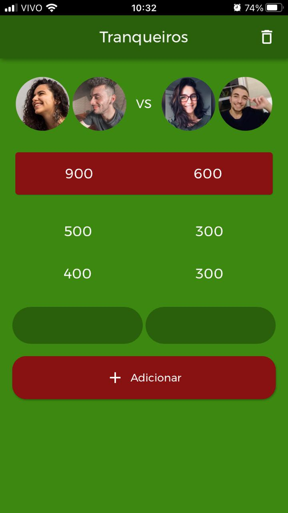

# Tranqueiros

O desafio ao redor desse aplicativo foi quanto ao tempo: foi desafiado a fazê-lo em uma hora. Não consegui alcançar o objetivo, excedi o tempo em 30 minutos, mas o resultado valeu a pena.

Se quiser dar uma olhada no web app (ele foi feito pra mobile, então as dimensões na web ficam estranhas), é só entrar [aqui](http://tranqueiros.s3-website-sa-east-1.amazonaws.com/#/)

## Melhorias

Hoje as imagens estão fixas no topo do app (sim, se quiser usar vai ser com minha foto), então acho que um próximo passo é fazer essa alteração e permitir upload de fotos ou fotografar direto pelo app.

Além disso, não há um histórico de partidas e nenhum tipo de armazenamento local. Se o app fecha, perde os dados, então esse é outro bom ponto para trabalhar em cima.
